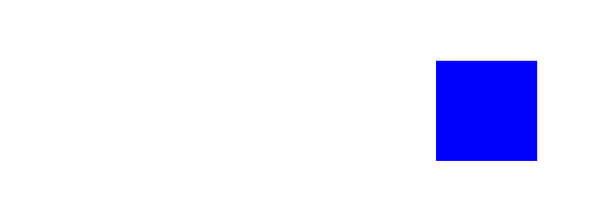
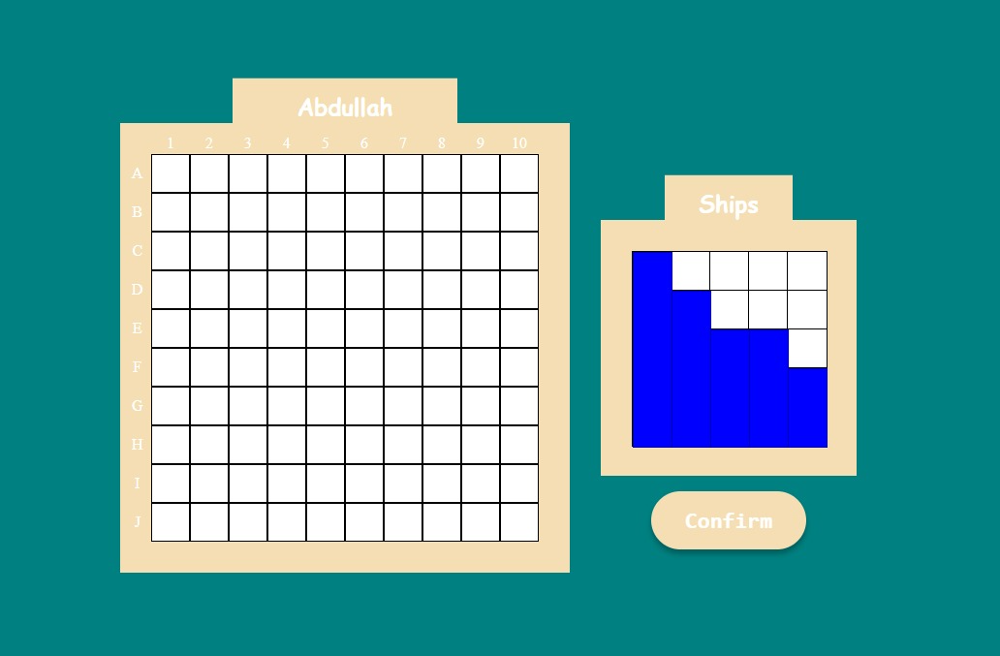
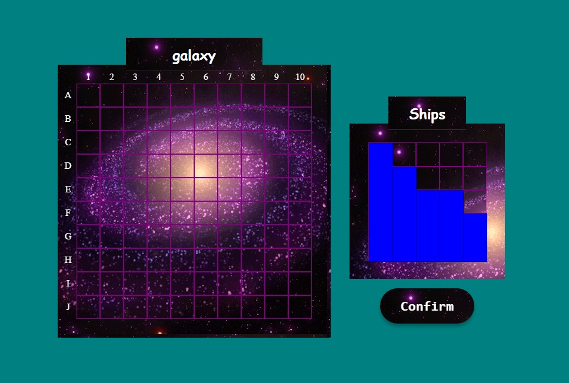
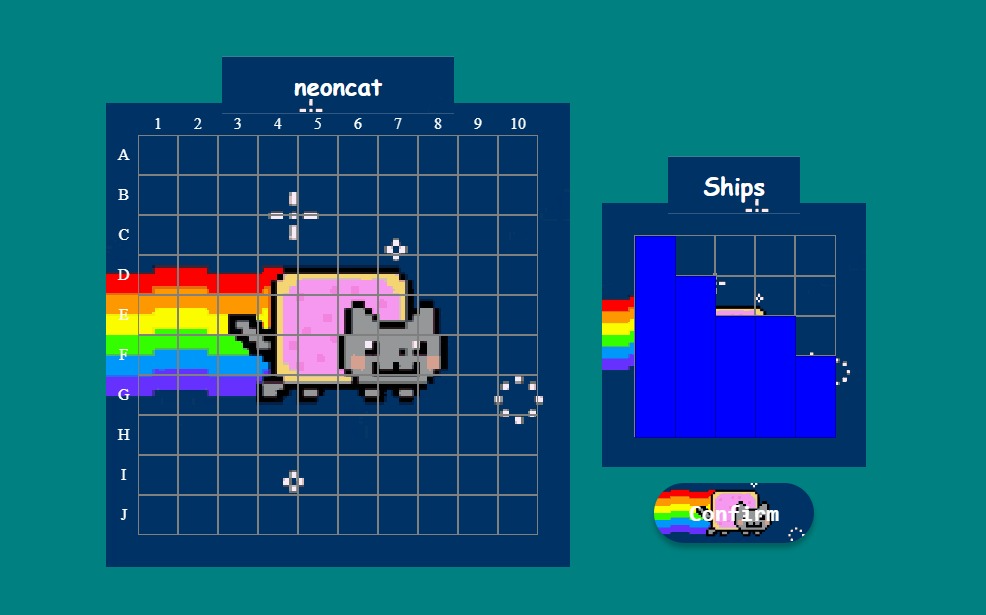
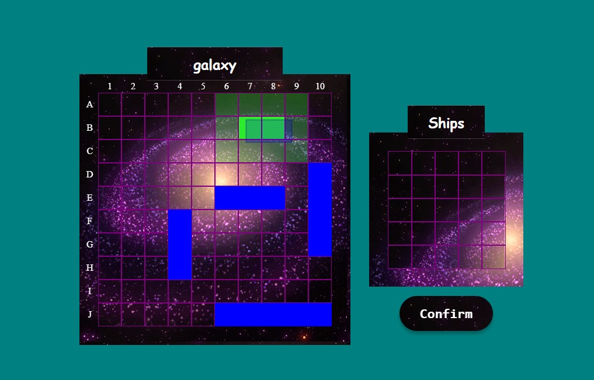
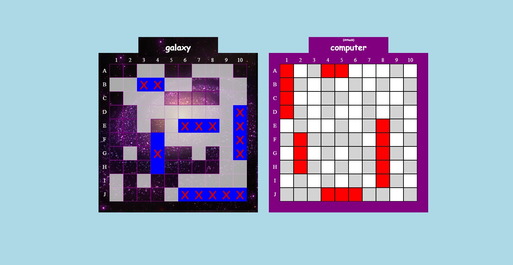
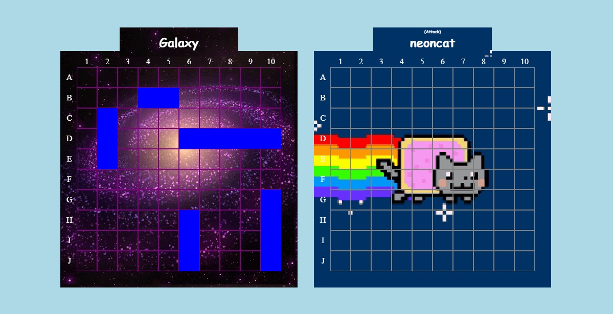
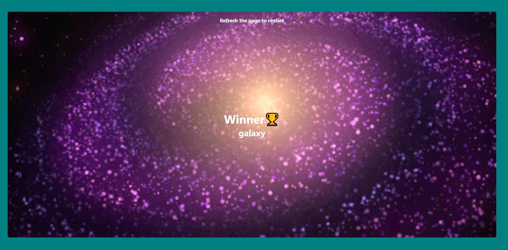

# Project: BattleShip

A simple implementation of the classic Battleship game.

### [Play Here](https://abdullahhatim.github.io/Project-Battleship-TOP/)

## Time Spent

Start: May 6, 2025

End: May 19, 2025

`(Project completed in 46~ hours across 13 days)`

I did have a Lot of fun

## Showcase

### Simple UI

### Explore Different Skins (23 Skins)

### Drag And Drop System

### Decent Computer AI

### 2 Players Mode!

#### Beautiful Winner Board

## How to Play

1. Place your ships
2. Choose second player
3. Allow them to place their ships without your knowledge
4. The goal is to destroy the other player's ships
5. Each player will make one move per turn
   for more information about the battleship game search google 'how to play battleship'

## Computer AI

- The AI is intentionally made easy
- This is the only part that was slightly vibe-coded

## Technologies Used

- Vscodium
- JavaScript
- HTML
- CSS
- Webpack
- Git
- Jest (for testing)

## Suggestions

Have a suggestion? Found a bug? or maybe you just want your own skin?

[Contact me on Telegram](http://t.me/Soo0B)

## notes

- I Did Keep a lot of unused stuff intentionally
- Spent longer than i need because i would probably put this on my portfolio (Inshallah)

